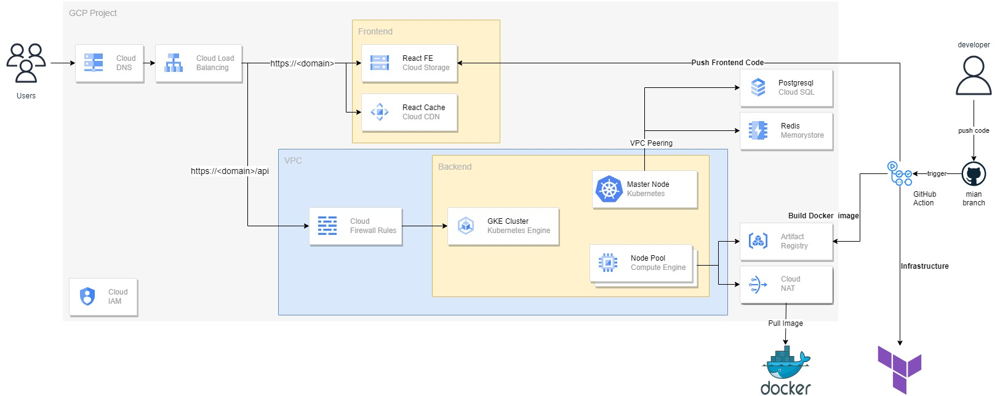

# LoginHub

## Description

LoginHub is a microservice-based application that provides authentication and authorization services for other applications.

## Tech Stack

- `Frontend`: React
- `Backend`: Node.js(Express)
- `Database`: PostgreSQL
- `Cache`: Redis
- `Message Broker`: RabbitMQ
- `Containerization`: Docker、Kubernetes
- `CI/CD`: GitHub Actions
- `Infrastructure`: Terraform、GCP

## Features

- `User signup`: Allows users to sign up for an account.
- `User login`: Allows users to log in to their account.
- `User logout`: Allows users to log out of their account.
- `Verify email`: Allows users to verify their email address.

## Architecture



## Folder Structure

- `frontend`: Contains the frontend code for the application.
- `backend`: Contains the backend code for the application.
- `kubernetes`: Contains the Kubernetes configuration files for the application.
- `postman`: Contains the Postman collection for the application.
- `deployment`: Contains the terraform configuration files for the application.

## Todo List

- [ ] Oauth
- [ ] OTP
- [ ] SMS
- [ ] Frontend
- [ ] Observability
- [ ] More boilerplate code

## Local Development

### Docker Compose

To run the application locally using Docker Compose, run the following command:

```bash
docker compose up -d
```

### MiniKube

Before running the application locally using MiniKube, make sure you have MiniKube installed, and also make sure you have pushed the Docker image to the DockerHub.

```bash
minikube start --driver=hyperv --insecure-registry "10.0.0.0/24"

minikube addons enable registry

# create production namespace
kubectl create namespace production

# apply all yaml file under ./kubernetes/local and change secrets
kubectl apply -f .
```

To enable the ingress controller, run the following command:

```bash
minikube addons enable ingress

minikube ip 

# add the following line to /etc/hosts
# <minikube ip> loginhub.com

minikube tunnel
```

To enable tls, run the following command:

```bash
# execute ./kubernetes/local/1-gateway/cert/generate_certs.sh

# apply loginhub.com.crt to keychain access

kubectl -n production create secret tls loginhub-tls --key loginhub.com.key --cert loginhub.com.crt

minikube addons configure ingress
# production/loginhub-tls 
# restart ingress
```

Finally, to access the application, open your browser and navigate to `https://loginhub.com`.

## GCP Deployment

Install GCLOUD and Terraform

```bash
# login to gcloud
gcloud auth application-default login

# create a bucket to store terraform state

# init terraform
terraform init --reconfigure -backend-config="<bucket_name>"

# apply terraform
# be careful with there are bug in terraform so you need to apply twice
terraform plan
terraform apply

# push docker image to google artifact registry
# you can see the command in the backend README.md

# apply all yaml file under kubernetes/gcp and change secrets
kubectl apply -f .

# reapply terraform and adjust vpc peering under netowrk module
```

k8s

```bash
kubectl create namespace production
```
